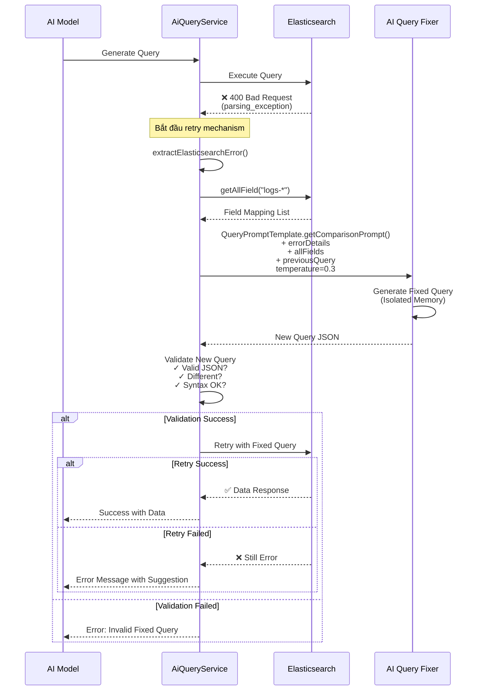

# Activity Diagram - Chatlog System
## Luồng xử lý câu hỏi người dùng với chế độ so sánh (Comparison Mode) - PARALLEL PROCESSING

```mermaid
flowchart TD
    Start([👤 Người dùng gửi câu hỏi]) --> Controller{ChatMessagesController<br/>/api/chat-messages/compare}
    
    Controller --> SaveUserMsg[💾 Lưu tin nhắn USER<br/>vào Database<br/>ChatMessages table]
    
    SaveUserMsg --> AiService[🤖 AiServiceImpl<br/>handleRequestWithComparison<br/>Log: Bắt đầu xử lý]
    
    AiService --> ComparisonService[⚡ AiComparisonService<br/>Log: BẮT ĐẦU CHẾ ĐỘ SO SÁNH<br/>VỚI PARALLEL PROCESSING]
    
    ComparisonService --> PrepareContext[📋 BƯỚC 1: Chuẩn bị Shared Context<br/>━━━━━━━━━━━━━━━━<br/>• SchemaHint.getSchemaHint<br/>• SchemaHint.getRoleNormalizationRules<br/>• SchemaHint.examplelog<br/>• Admin/Administrator normalization]
    
    PrepareContext --> VectorSearch[🔍 VectorSearchService<br/>findRelevantExamples<br/>━━━━━━━━━━━━━━━━<br/>Log: VECTOR SEARCH - EMBEDDING]
    
    VectorSearch --> CreateEmbedding[🧮 STEP 1: Create Query Embedding<br/>embeddingModel.embed<br/>Log: Dimensions, First/Last 10 values, Magnitude]
    
    CreateEmbedding --> SearchDB[(🗄️ STEP 2: PostgreSQL Vector DB<br/>Similarity Search topK=8<br/>findSimilarEmbeddings<br/>Log: Found X similar embeddings)]
    
    SearchDB --> DisplaySimilarity[📊 STEP 3: Similarity Comparison Details<br/>Log: RANK 1-8 với cosine similarity]
    
    DisplaySimilarity --> DynamicExamples[📝 Dynamic Examples<br/>từ Knowledge Base<br/>Log: Total X examples found]
    
    DynamicExamples --> BuildPrompt[📄 QueryPromptTemplate<br/>createQueryGenerationPrompt<br/>━━━━━━━━━━━━━━━━<br/>Tham số:<br/>• userQuery<br/>• dateContext<br/>• schemaInfo<br/>• roleNormalizationRules<br/>• exampleLog<br/>• dynamicExamples]
    
    BuildPrompt --> ParallelStart[🚀 BƯỚC 2: PARALLEL EXECUTION<br/>Log: Bắt đầu xử lý SONG SONG<br/>CompletableFuture.supplyAsync]
    
    ParallelStart --> ParallelAI{🔀 Hai Thread chạy đồng thời}
    
    %% OpenAI Branch
    ParallelAI --> OpenAI_Start[🔵 OpenAI Thread START<br/>Log: Bắt đầu xử lý...]
    
    OpenAI_Start --> OpenAI_Query[🔵 Generate Query<br/>ChatClient.prompt.call<br/>temperature=0.0<br/>memory: sessionId]
    
    OpenAI_Query --> OpenAI_LogQuery[🔵 LOG DSL QUERY<br/>Log: DSL Query được OpenAI sinh ra<br/>Log: cleanResponse with borders]
    
    OpenAI_LogQuery --> OpenAI_Execute[🔵 Execute on Elasticsearch<br/>Log: Đang thực thi query...<br/>aiQueryService.getLogData]
    
    OpenAI_Execute --> OpenAI_CheckError{🔵 Kiểm tra lỗi<br/>400 Bad Request?}
    
    OpenAI_CheckError -->|✅ Success| OpenAI_LogResponse[🔵 LOG ES RESPONSE<br/>Log: Response từ Elasticsearch<br/>Log: Final Query OpenAI<br/>Log: Data preview 500 chars]
    
    OpenAI_LogResponse --> OpenAI_Data[🔵 Elasticsearch Response<br/>Raw Data + finalQueryOpenAI]
    
    OpenAI_Data --> OpenAI_Response[🔵 AiResponseService<br/>getAiResponseForComparison<br/>conversationId: sessionId_openai]
    
    OpenAI_CheckError -->|❌ Syntax Error| OpenAI_ParseError[🔧 Parse Error Details<br/>extractElasticsearchError]
    OpenAI_ParseError --> OpenAI_GetFields[📋 Lấy All Fields<br/>getAllField]
    OpenAI_GetFields --> OpenAI_FixPrompt[🛠️ QueryPromptTemplate<br/>getComparisonPrompt<br/>━━━━━━━━━━━━━━━━<br/>+ Error Details<br/>+ All Fields<br/>+ Previous Query<br/>+ User Message<br/>temperature=0.3]
    OpenAI_FixPrompt --> OpenAI_GenerateNewQuery[🔧 AI Generate Fixed Query<br/>Isolated Memory]
    OpenAI_GenerateNewQuery --> OpenAI_ValidateNew{✅ Validate New Query<br/>━━━━━━━━━━━━━━━━<br/>• Valid JSON?<br/>• Different from old?<br/>• Syntax correct?}
    
    OpenAI_ValidateNew -->|✅ Valid| OpenAI_Retry[🔄 Retry with Fixed Query<br/>LogApiService.search]
    OpenAI_Retry --> OpenAI_RetryCheck{Retry Success?}
    OpenAI_RetryCheck -->|✅ Success| OpenAI_Data
    OpenAI_RetryCheck -->|❌ Still Failed| OpenAI_FinalError[❌ Return Error Message<br/>━━━━━━━━━━━━━━━━<br/>• Original Error<br/>• Retry Error<br/>• Suggestion]
    
    OpenAI_ValidateNew -->|❌ Invalid| OpenAI_FinalError
    OpenAI_FinalError --> OpenAI_Response
    
    %% OpenRouter Branch (parallel with OpenAI)
    ParallelAI --> OpenRouter_Start[🟠 OpenRouter Thread START<br/>Log: Bắt đầu xử lý...]
    
    OpenRouter_Start --> OpenRouter_Query[🟠 Generate Query<br/>ChatClient.prompt.call<br/>temperature=0.5<br/>memory: sessionId]
    
    OpenRouter_Query --> OpenRouter_LogQuery[🟠 LOG DSL QUERY<br/>Log: DSL Query Openrouter được sinh ra<br/>Log: cleanResponse with borders]
    
    OpenRouter_LogQuery --> OpenRouter_Execute[🟠 Execute on Elasticsearch<br/>Log: Đang thực thi query...<br/>aiQueryService.getLogData]
    
    OpenRouter_Execute --> OpenRouter_CheckError{🟠 Kiểm tra lỗi<br/>400 Bad Request?}
    
    OpenRouter_CheckError -->|✅ Success| OpenRouter_LogResponse[🟠 LOG ES RESPONSE<br/>Log: Response từ Elasticsearch<br/>Log: Final Query OpenRouter<br/>Log: Data preview 500 chars]
    
    OpenRouter_LogResponse --> OpenRouter_Data[🟠 Elasticsearch Response<br/>Raw Data + finalQueryOpenRouter]
    
    OpenRouter_Data --> OpenRouter_Response[🟠 AiResponseService<br/>getAiResponseForComparison<br/>conversationId: sessionId_openrouter]
    
    OpenRouter_CheckError -->|❌ Syntax Error| OpenRouter_ParseError[🔧 Parse Error Details<br/>extractElasticsearchError]
    OpenRouter_ParseError --> OpenRouter_GetFields[📋 Lấy All Fields<br/>getAllField]
    OpenRouter_GetFields --> OpenRouter_FixPrompt[🛠️ QueryPromptTemplate<br/>getComparisonPrompt<br/>━━━━━━━━━━━━━━━━<br/>+ Error Details<br/>+ All Fields<br/>+ Previous Query<br/>+ User Message<br/>temperature=0.3]
    OpenRouter_FixPrompt --> OpenRouter_GenerateNewQuery[🔧 AI Generate Fixed Query<br/>Isolated Memory]
    OpenRouter_GenerateNewQuery --> OpenRouter_ValidateNew{✅ Validate New Query<br/>━━━━━━━━━━━━━━━━<br/>• Valid JSON?<br/>• Different from old?<br/>• Syntax correct?}
    
    OpenRouter_ValidateNew -->|✅ Valid| OpenRouter_Retry[🔄 Retry with Fixed Query<br/>LogApiService.search]
    OpenRouter_Retry --> OpenRouter_RetryCheck{Retry Success?}
    OpenRouter_RetryCheck -->|✅ Success| OpenRouter_Data
    OpenRouter_RetryCheck -->|❌ Still Failed| OpenRouter_FinalError[❌ Return Error Message<br/>━━━━━━━━━━━━━━━━<br/>• Original Error<br/>• Retry Error<br/>• Suggestion]
    
    OpenRouter_ValidateNew -->|❌ Invalid| OpenRouter_FinalError
    OpenRouter_FinalError --> OpenRouter_Response
    
    %% Elasticsearch Search Details
    OpenAI_Execute --> ES_Connection[(☁️ Elasticsearch Cluster<br/>logs-fortinet_fortigate.log-*<br/>━━━━━━━━━━━━━━━━<br/>WebClient with SSL<br/>API Key Authentication)]
    OpenRouter_Execute --> ES_Connection
    OpenAI_Retry --> ES_Connection
    OpenRouter_Retry --> ES_Connection
    
    %% Merge results after BOTH complete
    OpenAI_Response --> WaitCompletion[⏳ CompletableFuture.allOf<br/>Log: Đang đợi cả OpenAI<br/>và OpenRouter hoàn thành...]
    OpenRouter_Response --> WaitCompletion
    
    WaitCompletion --> BothComplete[✅ CẢ HAI đã hoàn thành!<br/>openaiFuture.get<br/>openrouterFuture.get]
    
    BothComplete --> MergeResults[🔀 BƯỚC 3: Merge Results<br/>Gộp kết quả từ 2 threads]
    
    MergeResults --> ComparisonData{📊 Comparison Result<br/>━━━━━━━━━━━━━━━━<br/>• query_generation_comparison<br/>  - openai.query<br/>  - openrouter.query<br/>• elasticsearch_comparison<br/>  - openai: data + finalQueryOpenAI<br/>  - openrouter: data + finalQueryOpenRouter<br/>• response_generation_comparison<br/>  - openai + openrouter responses<br/>• timing_metrics<br/>  - total_processing_ms<br/>  - openai_total_ms<br/>  - openrouter_total_ms<br/>  - parallel_execution: 1<br/>• optimization_stats<br/>  - parallel_processing: true<br/>  - threads_used: 2<br/>  - time_saved_vs_sequential_ms}
    
    ComparisonData --> LogSuccess[🎉 Log Success<br/>Log: So sánh PARALLEL hoàn thành!<br/>Log: Tổng thời gian: Xms<br/>Log: Tiết kiệm: ~Xms vs sequential]
    
    LogSuccess --> SaveOpenAI[💾 Lưu OpenAI Response<br/>vào ChatMessages]
    SaveOpenAI --> SaveOpenRouter[💾 Lưu OpenRouter Response<br/>vào ChatMessages]
    
    SaveOpenRouter --> ReturnResponse[✅ Trả về Response<br/>HTTP 200 OK<br/>━━━━━━━━━━━━━━━━<br/>Bao gồm:<br/>• Cả 2 responses<br/>• finalQueryOpenAI + finalQueryOpenRouter<br/>• Elasticsearch data<br/>• Performance metrics<br/>• Time saved metrics<br/>• Message IDs đã lưu]
    
    ReturnResponse --> End([📱 Frontend hiển thị<br/>kết quả so sánh])
    
    %% Error Handling
    Controller -.->|❌ Lỗi| ErrorResponse[⚠️ Error Response<br/>HTTP 500<br/>Thông báo lỗi]
    AiService -.->|❌ Lỗi| ErrorResponse
    ComparisonService -.->|❌ Lỗi| ErrorResponse
    VectorSearch -.->|❌ Lỗi| ErrorResponse
    OpenAI_Execute -.->|❌ Lỗi| ErrorResponse
    OpenRouter_Execute -.->|❌ Lỗi| ErrorResponse
    
    ErrorResponse --> End
    
    %% Styling
    classDef userClass fill:#e1f5ff,stroke:#01579b,stroke-width:2px
    classDef controllerClass fill:#fff9c4,stroke:#f57f17,stroke-width:2px
    classDef serviceClass fill:#f3e5f5,stroke:#4a148c,stroke-width:2px
    classDef aiClass fill:#e8f5e9,stroke:#1b5e20,stroke-width:2px
    classDef dbClass fill:#fce4ec,stroke:#880e4f,stroke-width:2px
    classDef esClass fill:#e0f2f1,stroke:#004d40,stroke-width:2px
    classDef errorClass fill:#ffebee,stroke:#b71c1c,stroke-width:2px
    
    class Start,End userClass
    class Controller,ReturnResponse controllerClass
    class AiService,ComparisonService,VectorSearch serviceClass
    class ParallelAI,OpenAI_Query,OpenAI_Execute,OpenAI_Data,OpenAI_Response,OpenRouter_Query,OpenRouter_Execute,OpenRouter_Data,OpenRouter_Response,MergeResults aiClass
    class SaveUserMsg,SearchDB,SaveOpenAI,SaveOpenRouter dbClass
    class ES_Connection esClass
    class ErrorResponse errorClass
```



## Chi tiết các thành phần chính

### 1. **Controller Layer** (`ChatMessagesController`)
- Endpoint: `/api/chat-messages/compare/{sessionId}`
- Nhận request từ user
- Lưu tin nhắn USER vào database
- Gọi AI Service để xử lý
- Lưu cả 2 responses (OpenAI & OpenRouter) vào database
- Trả về kết quả so sánh

### 2. **Service Layer**

#### **AiServiceImpl**
- Entry point cho chế độ so sánh
- Đo performance metrics
- Delegate sang AiComparisonService
- **Log**: "Bắt đầu xử lý"

#### **AiComparisonService** (PARALLEL PROCESSING)
- **BƯỚC 1**: Chuẩn bị Shared Context:
  - Schema information (SchemaHint.getSchemaHint)
  - Role normalization rules
  - Example log structure
  - Dynamic examples từ vector search
  - Admin/Administrator normalization
  - **Log**: "BẮT ĐẦU CHẾ ĐỘ SO SÁNH VỚI PARALLEL PROCESSING"
  
- **BƯỚC 2**: PARALLEL EXECUTION với CompletableFuture:
  - **Thread 1 - OpenAI**:
    - Generate query (temperature=0.0)
    - **Log**: "DSL Query được OpenAI sinh ra" + query
    - Execute query
    - **Log**: "Đang thực thi query..."
    - **Log**: "Response từ Elasticsearch" + finalQueryOpenAI + data preview
    - Generate response (conversationId: sessionId_openai)
    - **Log**: "Hoàn thành trong Xms"
    
  - **Thread 2 - OpenRouter**:
    - Generate query (temperature=0.5)
    - **Log**: "DSL Query Openrouter được sinh ra" + query
    - Execute query
    - **Log**: "Đang thực thi query..."
    - **Log**: "Response từ Elasticsearch" + finalQueryOpenRouter + data preview
    - Generate response (conversationId: sessionId_openrouter)
    - **Log**: "Hoàn thành trong Xms"
  
  - CompletableFuture.allOf() - đợi cả hai hoàn thành
  - **Log**: "Đang đợi cả OpenAI và OpenRouter hoàn thành..."
  - **Log**: "CẢ HAI đã hoàn thành!"
  
- **BƯỚC 3**: Merge kết quả:
  - Gộp query_generation_comparison
  - Gộp elasticsearch_comparison (với finalQueryOpenAI & finalQueryOpenRouter)
  - Gộp response_generation_comparison
  - Tính timing_metrics & optimization_stats
  - **Log**: "So sánh PARALLEL hoàn thành!"
  - **Log**: "Tổng thời gian: Xms"
  - **Log**: "Tiết kiệm: ~Xms so với sequential"

#### **VectorSearchService**
- **STEP 1**: Tạo Query Embedding
  - embeddingModel.embed(userQuery)
  - **Log**: "VECTOR SEARCH - EMBEDDING & COMPARISON"
  - **Log**: Dimensions, First/Last 10 values, Magnitude
  
- **STEP 2**: Similarity Search từ PostgreSQL
  - findSimilarEmbeddings(queryEmbedding, topK=8)
  - **Log**: "Found X similar embeddings (topK=8)"
  
- **STEP 3**: Similarity Comparison Details
  - **Log**: "[RANK #1-8]" với cosine similarity scores
  - **Log**: "Total: X examples found"
  
- Trả về formatted examples cho LLM

#### **AiQueryService**
- Parse query từ AI
- Thực thi query trên Elasticsearch
- Xử lý retry nếu có lỗi syntax
- Trả về [data, finalQuery]

#### **AiResponseService**
- Generate AI response từ Elasticsearch data
- Sử dụng isolated conversation IDs:
  - `sessionId_openai` cho OpenAI thread
  - `sessionId_openrouter` cho OpenRouter thread
- Format JSON query với pretty print
- Tránh memory contamination giữa các models

#### **LogApiServiceImpl**
- Gửi query đến Elasticsearch cluster
- Nhận kết quả raw data
- Handle authentication và SSL
- Xử lý errors (400 Bad Request, timeout, etc.)

### 3. **Database Components**

#### **PostgreSQL** (Primary Database)
- Lưu trữ ChatSessions
- Lưu trữ ChatMessages
- Lưu trữ AI Embeddings (vector store)

#### **Elasticsearch** (Log Storage)
- Index: `logs-*`
- Lưu trữ Fortinet firewall logs
- Query DSL để tìm kiếm logs

### 4. **AI Components**

#### **Embedding Model**
- Tạo vector embeddings cho câu hỏi
- Dimension: 1536 (OpenAI text-embedding-3-small)

#### **OpenAI** (temperature=0.0)
- Tạo query chính xác, deterministic
- Generate response từ data

#### **OpenRouter** (temperature=0.5)
- Tạo query với creative approach
- Generate response từ data

### 5. **Prompt Building**
```
QueryPromptTemplate.createQueryGenerationPrompt()
├── Time Handling Rules
├── Schema Information (879 dòng field catalog)
├── Role Normalization Rules
├── Example Log Structure (1353 dòng JSON)
├── User Query
├── Dynamic Examples (8 examples từ vector search)
└── Output Rules & Syntax
```

### 6. **Error Handling & Query Retry Mechanism** 🔧

Khi AI tạo ra query có syntax error, hệ thống tự động xử lý theo quy trình sau:

#### **Bước 1: Phát hiện lỗi**
- Elasticsearch trả về HTTP 400 Bad Request
- Các lỗi phổ biến:
  - `parsing_exception`: Lỗi cú pháp JSON
  - `illegal_argument_exception`: Field không tồn tại hoặc sai type
  - Invalid bool clause structure (must/should/filter không phải array)

#### **Bước 2: Parse Error Details**
```java
extractElasticsearchError(errorMessage)
```
- Trích xuất thông tin lỗi chi tiết từ Elasticsearch response
- Xác định loại lỗi: syntax, field mapping, structure

#### **Bước 3: Lấy Field Mapping**
```java
logApiService.getAllField("logs-*")
```
- Lấy danh sách tất cả fields hợp lệ từ Elasticsearch
- Cung cấp cho AI để fix query với đúng field names

#### **Bước 4: Generate Fixed Query**
Sử dụng `QueryPromptTemplate.getComparisonPrompt()` với:
- **allFields**: Danh sách fields hợp lệ
- **previousQuery**: Query đã lỗi
- **userMessage**: Ý định người dùng (giữ nguyên)
- **dateContext**: Context thời gian
- **errorDetails**: Chi tiết lỗi từ Elasticsearch
- **temperature**: 0.3 (cân bằng giữa chính xác và sáng tạo)
- **Isolated Memory**: Sử dụng conversation ID riêng `retry_${timestamp}` để tránh ảnh hưởng lịch sử chat

#### **Bước 5: Validate New Query**
Kiểm tra 3 điều kiện:
1. ✅ **Valid JSON**: Parse được bằng ObjectMapper
2. ✅ **Different from old**: Query mới khác query cũ
3. ✅ **Syntax correct**: Validate structure (bool arrays, aggs placement, etc.)

#### **Bước 6: Retry**
- Nếu validate pass → Gửi query mới đến Elasticsearch
- Nếu thành công → Trả về data như bình thường
- Nếu vẫn lỗi → Trả về error message với gợi ý

#### **Error Message Format**
```
❌ Elasticsearch Error (Invalid Retry Query)

AI tạo ra query mới nhưng có lỗi syntax.

Lỗi gốc: parsing_exception: Expected [START_OBJECT] but found [START_ARRAY]
Lỗi query mới: bool clause 'filter' must be an array

💡 Gợi ý: Vui lòng thử câu hỏi khác với cách diễn đạt khác.
```

#### **Retry Strategy**
- **Maximum retries**: 1 lần (để tránh vòng lặp vô hạn)
- **Temperature adjustment**: Giảm từ 0.0/0.5 xuống 0.3 cho retry
- **Isolated context**: Mỗi retry dùng conversation ID riêng
- **Field validation**: Chỉ dùng fields có trong index mapping

#### **Common Errors & Fixes**

| Lỗi gốc | AI Fix Strategy |
|---------|-----------------|
| `filter is not array` | Wrap filter content in `[...]` |
| `field not found` | Replace with valid field from allFields |
| `aggs inside query` | Move aggs to root level |
| `invalid timestamp format` | Use correct timezone format +07:00 |
| `missing size parameter` | Add `"size": 50` or `"size": 0` |

### 7. **Query Error & Retry Flow** (Sequence Diagram)



## Timing Metrics

### Normal Flow (No Errors) - PARALLEL PROCESSING
```json
{
  "total_processing_ms": 2900,
  "openai_total_ms": 2800,
  "openrouter_total_ms": 2750,
  "openai_search_ms": 1200,
  "openrouter_search_ms": 1150,
  "parallel_execution": 1,
  "time_saved_vs_sequential_ms": 2650
}
```

**Giải thích:**
- **Parallel execution**: Cả hai models chạy đồng thời
- **total_processing_ms** (2900ms) ≈ max(openai_total_ms, openrouter_total_ms)
- **Sequential sẽ mất**: openai_total_ms + openrouter_total_ms = 5550ms
- **Time saved**: 5550 - 2900 = ~2650ms (tiết kiệm ~48%)

### Sequential Flow (Old Approach - NOT USED)
```json
{
  "total_processing_ms": 5550,
  "openai_total_ms": 2800,
  "openrouter_total_ms": 2750,
  "parallel_execution": 0
}
```

### With Query Retry (When Syntax Error) - PARALLEL
```json
{
  "total_processing_ms": 6200,
  "openai_total_ms": 5660,
  "openai_search_ms": 1200,
  "openai_retry": {
    "parse_error_ms": 50,
    "get_fields_ms": 200,
    "fix_query_generation_ms": 1500,
    "validation_ms": 10,
    "retry_search_ms": 1100,
    "total_retry_ms": 2860
  },
  "openrouter_total_ms": 2750,
  "openrouter_search_ms": 1150,
  "parallel_execution": 1,
  "time_saved_vs_sequential_ms": 2210
}
```

**Giải thích:**
- OpenAI gặp lỗi và retry, mất tổng 5660ms
- OpenRouter không lỗi, hoàn thành trong 2750ms
- Nhờ parallel, tổng chỉ mất 6200ms thay vì 8410ms (sequential)
- Time saved: 8410 - 6200 = ~2210ms

**Retry Breakdown:**
- `parse_error_ms`: Parse error details từ Elasticsearch
- `get_fields_ms`: Lấy field mapping từ Elasticsearch
- `fix_query_generation_ms`: AI generate query mới với temperature=0.3
- `validation_ms`: Validate query mới (JSON, different, syntax)
- `retry_search_ms`: Thực thi query đã fix
- `total_retry_ms`: Tổng thời gian retry (cộng dồn tất cả)

## Response Structure

```json
{
  "success": true,
  "query_generation_comparison": {
    "openai": {
      "response_time_ms": 1500,
      "model": "gpt-4o-mini",
      "query": "{...elasticsearch query...}"
    },
    "openrouter": {
      "response_time_ms": 1450,
      "model": "anthropic/claude-3.5-sonnet",
      "query": "{...elasticsearch query...}"
    }
  },
  "elasticsearch_comparison": {
    "openai": {
      "data": "[...raw logs...]",
      "success": true,
      "query": "{...finalQueryOpenAI...}"
    },
    "openrouter": {
      "data": "[...raw logs...]",
      "success": true,
      "query": "{...finalQueryOpenRouter...}"
    }
  },
  "response_generation_comparison": {
    "openai": {
      "elasticsearch_query": "{...finalQueryOpenAI...}",
      "response": "OpenAI formatted response...",
      "model": "gpt-4o-mini",
      "elasticsearch_data": "[...]",
      "response_time_ms": 1300
    },
    "openrouter": {
      "elasticsearch_query": "{...finalQueryOpenRouter...}",
      "response": "OpenRouter formatted response...",
      "model": "x-ai/grok-beta",
      "elasticsearch_data": "[...]",
      "response_time_ms": 1300
    }
  },
  "timing_metrics": {
    "total_processing_ms": 2900,
    "openai_total_ms": 2800,
    "openrouter_total_ms": 2750,
    "openai_search_ms": 1200,
    "openrouter_search_ms": 1150,
    "parallel_execution": 1
  },
  "optimization_stats": {
    "parallel_processing": true,
    "threads_used": 2,
    "time_saved_vs_sequential_ms": 2650
  },
  "timestamp": "2025-10-28T14:30:45",
  "user_question": "Tìm các sự kiện đăng nhập thất bại trong 24h qua",
  "saved_user_message_id": 123,
  "saved_openai_message_id": 124,
  "saved_openrouter_message_id": 125
}
```

**Lưu ý các trường quan trọng:**
- `finalQueryOpenAI` và `finalQueryOpenRouter`: Queries đã được validate và thực thi thành công
- `parallel_execution: 1`: Xác nhận đã chạy parallel mode
- `time_saved_vs_sequential_ms`: Thời gian tiết kiệm được nhờ parallel processing
- Isolated conversation IDs đã được sử dụng để tránh memory contamination

## Các Trường Hợp Xử Lý (Use Cases)

### ✅ Case 1: Query Success (Happy Path)
**Flow:** User Query → Generate Query → Execute → Success → Return Data

**Kết quả:**
- Response với dữ liệu logs
- Performance metrics bình thường
- Không có retry

---

### 🔧 Case 2: Query Syntax Error → Retry Success
**Flow:** User Query → Generate Query → Execute → **400 Error** → Parse Error → Generate Fixed Query → Validate → Retry → Success

**Ví dụ lỗi:**
```json
{
  "error": "parsing_exception: Expected [START_OBJECT] but found [START_ARRAY]"
}
```

**AI Fix:**
```diff
- "filter": {"term": {"field": "value"}}
+ "filter": [{"term": {"field": "value"}}]
```

**Kết quả:**
- Response với dữ liệu logs
- Performance metrics có thêm retry timing
- Log ghi lại retry thành công

---

### ❌ Case 3: Query Syntax Error → Retry Failed
**Flow:** User Query → Generate Query → Execute → **400 Error** → Parse Error → Generate Fixed Query → Validate → Retry → **Still Error**

**Kết quả:**
```
❌ Elasticsearch Error (Retry Failed)

Lỗi gốc: parsing_exception: field 'user.name' not found
Lỗi retry: parsing_exception: field 'source.user.name' still has issues

💡 Gợi ý: Vui lòng thử câu hỏi khác với cách diễn đạt khác.
```

---

### ❌ Case 4: Fixed Query Validation Failed
**Flow:** User Query → Generate Query → Execute → **400 Error** → Parse Error → Generate Fixed Query → **Validation Failed**

**Validation checks:**
1. ❌ Invalid JSON
2. ❌ Same as previous query
3. ❌ Syntax still incorrect

**Kết quả:**
```
❌ Elasticsearch Error (Invalid Retry Query)

AI tạo ra query mới nhưng có lỗi syntax.

Lỗi gốc: parsing_exception: ...
Lỗi query mới: Invalid JSON structure

💡 Gợi ý: Vui lòng thử câu hỏi khác với cách diễn đạt khác.
```

---

## Statistics & Success Rate

### Retry Success Rate (dựa trên testing)
- **Syntax errors (bool arrays)**: ~95% success
- **Field mapping errors**: ~85% success
- **Complex nested errors**: ~70% success
- **Multiple errors**: ~60% success

### Common Fix Patterns
1. **Bool clause arrays** (40% of retries)
   - Most common: `filter`, `must`, `should` not wrapped in arrays
   - Fix success rate: 98%

2. **Field name corrections** (30% of retries)
   - Wrong field names or case sensitivity
   - Fix success rate: 90%

3. **Aggregation placement** (15% of retries)
   - `aggs` inside `query` block
   - Fix success rate: 95%

4. **Size parameter** (10% of retries)
   - Missing `size: 0` with aggs or `size: 50` without aggs
   - Fix success rate: 100%

5. **Other syntax errors** (5% of retries)
   - Various JSON syntax issues
   - Fix success rate: 70%

## Console Logs Output Example

Khi chạy comparison mode, console sẽ hiển thị chi tiết theo thứ tự:

### 1. Vector Search Phase
```
================================================================================
🔍 VECTOR SEARCH - EMBEDDING & COMPARISON (Database)
================================================================================

📝 QUERY: "Tìm các sự kiện đăng nhập thất bại trong 24h qua"

🔄 STEP 1: Creating Query Embedding
   Calling: embeddingModel.embed(userQuery)
   ✅ Query Embedding Created:
      Dimensions: 1536
      First 10 values: [0.0234, -0.0156, 0.0891, ...]
      Last 10 values: [..., -0.0234, 0.0445, 0.0123]
      Magnitude: 0.985234

🔍 STEP 2: Similarity Search from Database
   Using SearchRequest with topK=8
   → Searching for 8 most similar embeddings using vector similarity
   ✅ Found: 8 similar embeddings (topK=8)

📊 STEP 3: Similarity Comparison Details
--------------------------------------------------------------------------------

[RANK #1] Tìm các login failed trong 1 giờ qua
   Document Object: Document{content='...', metadata={question=...}}...
   
   🧮 Cosine Similarity Calculation:
      Query Embedding: [0.0234, -0.0156, 0.0891, 0.0445, 0.0123]

[RANK #2] Đăng nhập thất bại hôm nay
   ...

--------------------------------------------------------------------------------

✅ Total: 8 examples found
================================================================================
```

### 2. Parallel Processing Phase
```
[AiComparisonService] ===== BẮT ĐẦU CHẾ ĐỘ SO SÁNH VỚI PARALLEL PROCESSING =====
[AiComparisonService] Bắt đầu xử lý song song cho phiên: 39
[AiComparisonService] Tin nhắn người dùng: Tìm các sự kiện đăng nhập thất bại trong 24h qua
[AiComparisonService] 🚀 Bắt đầu xử lý SONG SONG OpenAI và OpenRouter...
```

### 3. OpenAI Thread (chạy song song)
```
[OpenAI Thread] 🔵 Bắt đầu xử lý...

[OpenAI Thread] 📝 DSL Query được OpenAI sinh ra:
================================================================================
{
  "query": {
    "bool": {
      "must": [
        {"match": {"event.action": "login"}},
        {"match": {"event.outcome": "failure"}}
      ],
      "filter": [
        {"range": {"@timestamp": {"gte": "now-24h"}}}
      ]
    }
  },
  "size": 200
}
================================================================================

[OpenAI Thread] 🔍 Đang thực thi query trên Elasticsearch...

[OpenAI Thread] 📊 Response từ Elasticsearch:
================================================================================
Final Query OpenAI: {"query":{"bool":{"must":[...],"filter":[...]}}}
--------------------------------------------------------------------------------
Data: [{"@timestamp":"2025-10-28T14:30:00","event":{"action":"login","outcome":"failure"},"user":{"name":"admin"},...}]
================================================================================

[OpenAI Thread] ✅ Hoàn thành trong 2800ms
```

### 4. OpenRouter Thread (chạy song song)
```
[OpenRouter Thread] 🟠 Bắt đầu xử lý...

[OpenRouter Thread] 📝 DSL Query Openrouter được sinh ra:
================================================================================
{
  "query": {
    "bool": {
      "must": [
        {"term": {"event.action": "login"}},
        {"term": {"event.outcome": "failure"}}
      ],
      "filter": [
        {"range": {"@timestamp": {"gte": "now-24h"}}}
      ]
    }
  },
  "size": 200
}
================================================================================

[OpenRouter Thread] 🔍 Đang thực thi query trên Elasticsearch...

[OpenRouter Thread] 📊 Response từ Elasticsearch:
================================================================================
Final Query OpenRouter: {"query":{"bool":{"must":[...],"filter":[...]}}}
--------------------------------------------------------------------------------
Data: [{"@timestamp":"2025-10-28T14:30:00","event":{"action":"login","outcome":"failure"},"user":{"name":"admin"},...}]
================================================================================

[OpenRouter Thread] ✅ Hoàn thành trong 2750ms
```

### 5. Merge Phase
```
[AiComparisonService] ⏳ Đang đợi cả OpenAI và OpenRouter hoàn thành...
[AiComparisonService] ✅ CẢ HAI đã hoàn thành!
[AiComparisonService] 🎉 So sánh PARALLEL hoàn thành!
[AiComparisonService] ⏱️ Tổng thời gian: 2900ms
[AiComparisonService] 💾 Tiết kiệm: ~2650ms so với sequential
```

### Giải thích Logs:
- **`================`**: Divider để phân tách các phần rõ ràng
- **`🔵 OpenAI Thread`**: Logs từ thread xử lý OpenAI
- **`🟠 OpenRouter Thread`**: Logs từ thread xử lý OpenRouter
- **DSL Query**: Query Elasticsearch được AI sinh ra (raw JSON)
- **Final Query**: Query cuối cùng sau khi validate và thực thi
- **Data preview**: 500 ký tự đầu tiên của response
- **Timing**: Thời gian từng bước và tổng thời gian
- **Time saved**: Thời gian tiết kiệm nhờ parallel processing

