# Activity Diagram - Chatlog System
## Luồng xử lý câu hỏi người dùng với chế độ so sánh (Comparison Mode)

```mermaid
flowchart TD
    Start([👤 Người dùng gửi câu hỏi]) --> Controller{ChatMessagesController<br/>/api/chat-messages/compare}
    
    Controller --> SaveUserMsg[💾 Lưu tin nhắn USER<br/>vào Database<br/>ChatMessages table]
    
    SaveUserMsg --> AiService[🤖 AiServiceImpl<br/>handleRequestWithComparison]
    
    AiService --> ComparisonService[⚡ AiComparisonService<br/>Bắt đầu chế độ so sánh]
    
    ComparisonService --> GetSchema[📋 Lấy Schema Information<br/>SchemaHint.getSchemaHint]
    
    GetSchema --> GetRoleRules[📋 Lấy Role Normalization Rules<br/>SchemaHint.getRoleNormalizationRules]
    
    GetRoleRules --> GetExampleLog[📋 Lấy Example Log<br/>SchemaHint.examplelog]
    
    GetExampleLog --> VectorSearch[🔍 VectorSearchService<br/>findRelevantExamples]
    
    VectorSearch --> CreateEmbedding[🧮 Tạo Query Embedding<br/>embeddingModel.embed]
    
    CreateEmbedding --> SearchDB[(🗄️ PostgreSQL Vector DB<br/>Similarity Search<br/>topK=8)]
    
    SearchDB --> DynamicExamples[📝 Dynamic Examples<br/>từ Knowledge Base]
    
    DynamicExamples --> BuildPrompt[📄 QueryPromptTemplate<br/>createQueryGenerationPrompt<br/>━━━━━━━━━━━━━━━━<br/>Tham số:<br/>• userQuery<br/>• dateContext<br/>• schemaInfo<br/>• roleNormalizationRules<br/>• exampleLog<br/>• dynamicExamples]
    
    BuildPrompt --> ParallelAI{🔀 Xử lý song song}
    
    %% OpenAI Branch
    ParallelAI --> OpenAI_Query[🔵 OPENAI<br/>Tạo Elasticsearch Query<br/>temperature=0.0]
    OpenAI_Query --> OpenAI_Execute[🔵 Execute Query<br/>LogApiService.search]
    OpenAI_Execute --> OpenAI_CheckError{🔵 Kiểm tra lỗi<br/>400 Bad Request?}
    
    OpenAI_CheckError -->|✅ Success| OpenAI_Data[🔵 Elasticsearch Response<br/>Raw Data]
    OpenAI_Data --> OpenAI_Response[🔵 AiResponseService<br/>Tạo phản hồi từ data]
    
    OpenAI_CheckError -->|❌ Syntax Error| OpenAI_ParseError[🔧 Parse Error Details<br/>extractElasticsearchError]
    OpenAI_ParseError --> OpenAI_GetFields[📋 Lấy All Fields<br/>getAllField]
    OpenAI_GetFields --> OpenAI_FixPrompt[🛠️ QueryPromptTemplate<br/>getComparisonPrompt<br/>━━━━━━━━━━━━━━━━<br/>+ Error Details<br/>+ All Fields<br/>+ Previous Query<br/>+ User Message<br/>temperature=0.3]
    OpenAI_FixPrompt --> OpenAI_GenerateNewQuery[🔧 AI Generate Fixed Query<br/>Isolated Memory]
    OpenAI_GenerateNewQuery --> OpenAI_ValidateNew{✅ Validate New Query<br/>━━━━━━━━━━━━━━━━<br/>• Valid JSON?<br/>• Different from old?<br/>• Syntax correct?}
    
    OpenAI_ValidateNew -->|✅ Valid| OpenAI_Retry[🔄 Retry with Fixed Query<br/>LogApiService.search]
    OpenAI_Retry --> OpenAI_RetryCheck{Retry Success?}
    OpenAI_RetryCheck -->|✅ Success| OpenAI_Data
    OpenAI_RetryCheck -->|❌ Still Failed| OpenAI_FinalError[❌ Return Error Message<br/>━━━━━━━━━━━━━━━━<br/>• Original Error<br/>• Retry Error<br/>• Suggestion]
    
    OpenAI_ValidateNew -->|❌ Invalid| OpenAI_FinalError
    OpenAI_FinalError --> OpenAI_Response
    
    %% OpenRouter Branch (tương tự)
    ParallelAI --> OpenRouter_Query[🟠 OPENROUTER<br/>Tạo Elasticsearch Query<br/>temperature=0.5]
    OpenRouter_Query --> OpenRouter_Execute[🟠 Execute Query<br/>LogApiService.search]
    OpenRouter_Execute --> OpenRouter_CheckError{🟠 Kiểm tra lỗi<br/>400 Bad Request?}
    
    OpenRouter_CheckError -->|✅ Success| OpenRouter_Data[🟠 Elasticsearch Response<br/>Raw Data]
    OpenRouter_Data --> OpenRouter_Response[🟠 AiResponseService<br/>Tạo phản hồi từ data]
    
    OpenRouter_CheckError -->|❌ Syntax Error| OpenRouter_ParseError[🔧 Parse Error Details<br/>extractElasticsearchError]
    OpenRouter_ParseError --> OpenRouter_GetFields[📋 Lấy All Fields<br/>getAllField]
    OpenRouter_GetFields --> OpenRouter_FixPrompt[🛠️ QueryPromptTemplate<br/>getComparisonPrompt<br/>━━━━━━━━━━━━━━━━<br/>+ Error Details<br/>+ All Fields<br/>+ Previous Query<br/>+ User Message<br/>temperature=0.3]
    OpenRouter_FixPrompt --> OpenRouter_GenerateNewQuery[🔧 AI Generate Fixed Query<br/>Isolated Memory]
    OpenRouter_GenerateNewQuery --> OpenRouter_ValidateNew{✅ Validate New Query<br/>━━━━━━━━━━━━━━━━<br/>• Valid JSON?<br/>• Different from old?<br/>• Syntax correct?}
    
    OpenRouter_ValidateNew -->|✅ Valid| OpenRouter_Retry[🔄 Retry with Fixed Query<br/>LogApiService.search]
    OpenRouter_Retry --> OpenRouter_RetryCheck{Retry Success?}
    OpenRouter_RetryCheck -->|✅ Success| OpenRouter_Data
    OpenRouter_RetryCheck -->|❌ Still Failed| OpenRouter_FinalError[❌ Return Error Message<br/>━━━━━━━━━━━━━━━━<br/>• Original Error<br/>• Retry Error<br/>• Suggestion]
    
    OpenRouter_ValidateNew -->|❌ Invalid| OpenRouter_FinalError
    OpenRouter_FinalError --> OpenRouter_Response
    
    %% Elasticsearch Search Details
    OpenAI_Execute --> ES_Connection[(☁️ Elasticsearch Cluster<br/>logs-fortinet_fortigate.log-*<br/>━━━━━━━━━━━━━━━━<br/>WebClient with SSL<br/>API Key Authentication)]
    OpenRouter_Execute --> ES_Connection
    OpenAI_Retry --> ES_Connection
    OpenRouter_Retry --> ES_Connection
    
    %% Merge results
    OpenAI_Response --> MergeResults[🔀 Gộp kết quả<br/>Comparison Result]
    OpenRouter_Response --> MergeResults
    
    MergeResults --> ComparisonData{📊 Comparison Result<br/>━━━━━━━━━━━━━━━━<br/>• query_generation_comparison<br/>• elasticsearch_comparison<br/>• response_generation_comparison<br/>• timing_metrics<br/>• optimization_stats}
    
    ComparisonData --> SaveOpenAI[💾 Lưu OpenAI Response<br/>vào ChatMessages]
    SaveOpenAI --> SaveOpenRouter[💾 Lưu OpenRouter Response<br/>vào ChatMessages]
    
    SaveOpenRouter --> ReturnResponse[✅ Trả về Response<br/>HTTP 200 OK<br/>━━━━━━━━━━━━━━━━<br/>Bao gồm:<br/>• Cả 2 responses<br/>• Queries đã generate<br/>• Elasticsearch data<br/>• Performance metrics<br/>• Message IDs đã lưu]
    
    ReturnResponse --> End([📱 Frontend hiển thị<br/>kết quả so sánh])
    
    %% Error Handling
    Controller -.->|❌ Lỗi| ErrorResponse[⚠️ Error Response<br/>HTTP 500<br/>Thông báo lỗi]
    AiService -.->|❌ Lỗi| ErrorResponse
    ComparisonService -.->|❌ Lỗi| ErrorResponse
    VectorSearch -.->|❌ Lỗi| ErrorResponse
    OpenAI_Execute -.->|❌ Lỗi| ErrorResponse
    OpenRouter_Execute -.->|❌ Lỗi| ErrorResponse
    
    ErrorResponse --> End
    
    %% Styling
    classDef userClass fill:#e1f5ff,stroke:#01579b,stroke-width:2px
    classDef controllerClass fill:#fff9c4,stroke:#f57f17,stroke-width:2px
    classDef serviceClass fill:#f3e5f5,stroke:#4a148c,stroke-width:2px
    classDef aiClass fill:#e8f5e9,stroke:#1b5e20,stroke-width:2px
    classDef dbClass fill:#fce4ec,stroke:#880e4f,stroke-width:2px
    classDef esClass fill:#e0f2f1,stroke:#004d40,stroke-width:2px
    classDef errorClass fill:#ffebee,stroke:#b71c1c,stroke-width:2px
    
    class Start,End userClass
    class Controller,ReturnResponse controllerClass
    class AiService,ComparisonService,VectorSearch serviceClass
    class ParallelAI,OpenAI_Query,OpenAI_Execute,OpenAI_Data,OpenAI_Response,OpenRouter_Query,OpenRouter_Execute,OpenRouter_Data,OpenRouter_Response,MergeResults aiClass
    class SaveUserMsg,SearchDB,SaveOpenAI,SaveOpenRouter dbClass
    class ES_Connection esClass
    class ErrorResponse errorClass
```



## Chi tiết các thành phần chính

### 1. **Controller Layer** (`ChatMessagesController`)
- Endpoint: `/api/chat-messages/compare/{sessionId}`
- Nhận request từ user
- Lưu tin nhắn USER vào database
- Gọi AI Service để xử lý
- Lưu cả 2 responses (OpenAI & OpenRouter) vào database
- Trả về kết quả so sánh

### 2. **Service Layer**

#### **AiServiceImpl**
- Entry point cho chế độ so sánh
- Đo performance metrics
- Delegate sang AiComparisonService

#### **AiComparisonService**
- **Bước 1**: Chuẩn bị prompt với:
  - Schema information
  - Role normalization rules
  - Example log structure
  - Dynamic examples từ vector search
  
- **Bước 2**: Xử lý song song OpenAI và OpenRouter:
  - Tạo Elasticsearch query
  - Thực thi query
  - Nhận data từ Elasticsearch
  - Tạo response từ data
  
- **Bước 3**: Merge kết quả và trả về

#### **VectorSearchService**
- Tạo embedding cho câu hỏi người dùng
- Tìm kiếm semantic similarity trong PostgreSQL Vector DB
- Trả về top 8 examples tương tự nhất

#### **LogApiServiceImpl**
- Gửi query đến Elasticsearch
- Nhận kết quả raw data
- Handle authentication và SSL

### 3. **Database Components**

#### **PostgreSQL** (Primary Database)
- Lưu trữ ChatSessions
- Lưu trữ ChatMessages
- Lưu trữ AI Embeddings (vector store)

#### **Elasticsearch** (Log Storage)
- Index: `logs-*`
- Lưu trữ Fortinet firewall logs
- Query DSL để tìm kiếm logs

### 4. **AI Components**

#### **Embedding Model**
- Tạo vector embeddings cho câu hỏi
- Dimension: 1536 (OpenAI text-embedding-3-small)

#### **OpenAI** (temperature=0.0)
- Tạo query chính xác, deterministic
- Generate response từ data

#### **OpenRouter** (temperature=0.5)
- Tạo query với creative approach
- Generate response từ data

### 5. **Prompt Building**
```
QueryPromptTemplate.createQueryGenerationPrompt()
├── Time Handling Rules
├── Schema Information (879 dòng field catalog)
├── Role Normalization Rules
├── Example Log Structure (1353 dòng JSON)
├── User Query
├── Dynamic Examples (8 examples từ vector search)
└── Output Rules & Syntax
```

### 6. **Error Handling & Query Retry Mechanism** 🔧

Khi AI tạo ra query có syntax error, hệ thống tự động xử lý theo quy trình sau:

#### **Bước 1: Phát hiện lỗi**
- Elasticsearch trả về HTTP 400 Bad Request
- Các lỗi phổ biến:
  - `parsing_exception`: Lỗi cú pháp JSON
  - `illegal_argument_exception`: Field không tồn tại hoặc sai type
  - Invalid bool clause structure (must/should/filter không phải array)

#### **Bước 2: Parse Error Details**
```java
extractElasticsearchError(errorMessage)
```
- Trích xuất thông tin lỗi chi tiết từ Elasticsearch response
- Xác định loại lỗi: syntax, field mapping, structure

#### **Bước 3: Lấy Field Mapping**
```java
logApiService.getAllField("logs-*")
```
- Lấy danh sách tất cả fields hợp lệ từ Elasticsearch
- Cung cấp cho AI để fix query với đúng field names

#### **Bước 4: Generate Fixed Query**
Sử dụng `QueryPromptTemplate.getComparisonPrompt()` với:
- **allFields**: Danh sách fields hợp lệ
- **previousQuery**: Query đã lỗi
- **userMessage**: Ý định người dùng (giữ nguyên)
- **dateContext**: Context thời gian
- **errorDetails**: Chi tiết lỗi từ Elasticsearch
- **temperature**: 0.3 (cân bằng giữa chính xác và sáng tạo)
- **Isolated Memory**: Sử dụng conversation ID riêng `retry_${timestamp}` để tránh ảnh hưởng lịch sử chat

#### **Bước 5: Validate New Query**
Kiểm tra 3 điều kiện:
1. ✅ **Valid JSON**: Parse được bằng ObjectMapper
2. ✅ **Different from old**: Query mới khác query cũ
3. ✅ **Syntax correct**: Validate structure (bool arrays, aggs placement, etc.)

#### **Bước 6: Retry**
- Nếu validate pass → Gửi query mới đến Elasticsearch
- Nếu thành công → Trả về data như bình thường
- Nếu vẫn lỗi → Trả về error message với gợi ý

#### **Error Message Format**
```
❌ Elasticsearch Error (Invalid Retry Query)

AI tạo ra query mới nhưng có lỗi syntax.

Lỗi gốc: parsing_exception: Expected [START_OBJECT] but found [START_ARRAY]
Lỗi query mới: bool clause 'filter' must be an array

💡 Gợi ý: Vui lòng thử câu hỏi khác với cách diễn đạt khác.
```

#### **Retry Strategy**
- **Maximum retries**: 1 lần (để tránh vòng lặp vô hạn)
- **Temperature adjustment**: Giảm từ 0.0/0.5 xuống 0.3 cho retry
- **Isolated context**: Mỗi retry dùng conversation ID riêng
- **Field validation**: Chỉ dùng fields có trong index mapping

#### **Common Errors & Fixes**

| Lỗi gốc | AI Fix Strategy |
|---------|-----------------|
| `filter is not array` | Wrap filter content in `[...]` |
| `field not found` | Replace with valid field from allFields |
| `aggs inside query` | Move aggs to root level |
| `invalid timestamp format` | Use correct timezone format +07:00 |
| `missing size parameter` | Add `"size": 50` or `"size": 0` |

### 7. **Query Error & Retry Flow** (Sequence Diagram)

```mermaid
sequenceDiagram
    participant AI as AI Model
    participant QS as AiQueryService
    participant ES as Elasticsearch
    participant Fix as AI Query Fixer
    
    AI->>QS: Generate Query
    QS->>ES: Execute Query
    ES-->>QS: ❌ 400 Bad Request<br/>(parsing_exception)
    
    Note over QS: Bắt đầu retry mechanism
    
    QS->>QS: extractElasticsearchError()
    QS->>ES: getAllField("logs-*")
    ES-->>QS: Field Mapping List
    
    QS->>Fix: QueryPromptTemplate.getComparisonPrompt()<br/>+ errorDetails<br/>+ allFields<br/>+ previousQuery<br/>temperature=0.3
    
    Fix->>Fix: Generate Fixed Query<br/>(Isolated Memory)
    Fix-->>QS: New Query JSON
    
    QS->>QS: Validate New Query<br/>✓ Valid JSON?<br/>✓ Different?<br/>✓ Syntax OK?
    
    alt Validation Success
        QS->>ES: Retry with Fixed Query
        alt Retry Success
            ES-->>QS: ✅ Data Response
            QS-->>AI: Success with Data
        else Retry Failed
            ES-->>QS: ❌ Still Error
            QS-->>AI: Error Message with Suggestion
        end
    else Validation Failed
        QS-->>AI: Error: Invalid Fixed Query
    end
```



## Timing Metrics

### Normal Flow (No Errors)
```json
{
  "context_building_ms": 0,
  "openai_search_ms": 1200,
  "openrouter_search_ms": 1150,
  "openai_total_ms": 2800,
  "openrouter_total_ms": 2750,
  "total_processing_ms": 3500
}
```

### With Query Retry (When Syntax Error)
```json
{
  "context_building_ms": 0,
  "openai_search_ms": 1200,
  "openai_retry": {
    "parse_error_ms": 50,
    "get_fields_ms": 200,
    "fix_query_generation_ms": 1500,
    "validation_ms": 10,
    "retry_search_ms": 1100,
    "total_retry_ms": 2860
  },
  "openrouter_search_ms": 1150,
  "openai_total_ms": 5660,
  "openrouter_total_ms": 2750,
  "total_processing_ms": 6200
}
```

**Giải thích:**
- `parse_error_ms`: Thời gian parse error details từ Elasticsearch
- `get_fields_ms`: Thời gian lấy field mapping từ Elasticsearch
- `fix_query_generation_ms`: Thời gian AI generate query mới
- `validation_ms`: Thời gian validate query mới
- `retry_search_ms`: Thời gian thực thi query đã fix
- `total_retry_ms`: Tổng thời gian retry (cộng dồn tất cả)

## Response Structure

```json
{
  "success": true,
  "query_generation_comparison": {
    "openai": {
      "response_time_ms": 1500,
      "model": "gpt-4o-mini",
      "query": "{...elasticsearch query...}"
    },
    "openrouter": {
      "response_time_ms": 1450,
      "model": "anthropic/claude-3.5-sonnet",
      "query": "{...elasticsearch query...}"
    }
  },
  "elasticsearch_comparison": {
    "openai": {
      "data": "[...raw logs...]",
      "success": true,
      "query": "{...final query...}"
    },
    "openrouter": {
      "data": "[...raw logs...]",
      "success": true,
      "query": "{...final query...}"
    }
  },
  "response_generation_comparison": {
    "openai": {
      "elasticsearch_query": "{...}",
      "response": "OpenAI formatted response...",
      "model": "gpt-4o-mini",
      "elasticsearch_data": "[...]",
      "response_time_ms": 1300
    },
    "openrouter": {
      "elasticsearch_query": "{...}",
      "response": "OpenRouter formatted response...",
      "model": "x-ai/grok-4-fast",
      "elasticsearch_data": "[...]",
      "response_time_ms": 1300
    }
  },
  "timing_metrics": {...},
  "optimization_stats": {...},
  "saved_user_message_id": 123,
  "saved_openai_message_id": 124,
  "saved_openrouter_message_id": 125
}
```

## Các Trường Hợp Xử Lý (Use Cases)

### ✅ Case 1: Query Success (Happy Path)
**Flow:** User Query → Generate Query → Execute → Success → Return Data

**Kết quả:**
- Response với dữ liệu logs
- Performance metrics bình thường
- Không có retry

---

### 🔧 Case 2: Query Syntax Error → Retry Success
**Flow:** User Query → Generate Query → Execute → **400 Error** → Parse Error → Generate Fixed Query → Validate → Retry → Success

**Ví dụ lỗi:**
```json
{
  "error": "parsing_exception: Expected [START_OBJECT] but found [START_ARRAY]"
}
```

**AI Fix:**
```diff
- "filter": {"term": {"field": "value"}}
+ "filter": [{"term": {"field": "value"}}]
```

**Kết quả:**
- Response với dữ liệu logs
- Performance metrics có thêm retry timing
- Log ghi lại retry thành công

---

### ❌ Case 3: Query Syntax Error → Retry Failed
**Flow:** User Query → Generate Query → Execute → **400 Error** → Parse Error → Generate Fixed Query → Validate → Retry → **Still Error**

**Kết quả:**
```
❌ Elasticsearch Error (Retry Failed)

Lỗi gốc: parsing_exception: field 'user.name' not found
Lỗi retry: parsing_exception: field 'source.user.name' still has issues

💡 Gợi ý: Vui lòng thử câu hỏi khác với cách diễn đạt khác.
```

---

### ❌ Case 4: Fixed Query Validation Failed
**Flow:** User Query → Generate Query → Execute → **400 Error** → Parse Error → Generate Fixed Query → **Validation Failed**

**Validation checks:**
1. ❌ Invalid JSON
2. ❌ Same as previous query
3. ❌ Syntax still incorrect

**Kết quả:**
```
❌ Elasticsearch Error (Invalid Retry Query)

AI tạo ra query mới nhưng có lỗi syntax.

Lỗi gốc: parsing_exception: ...
Lỗi query mới: Invalid JSON structure

💡 Gợi ý: Vui lòng thử câu hỏi khác với cách diễn đạt khác.
```

---

## Statistics & Success Rate

### Retry Success Rate (dựa trên testing)
- **Syntax errors (bool arrays)**: ~95% success
- **Field mapping errors**: ~85% success
- **Complex nested errors**: ~70% success
- **Multiple errors**: ~60% success

### Common Fix Patterns
1. **Bool clause arrays** (40% of retries)
   - Most common: `filter`, `must`, `should` not wrapped in arrays
   - Fix success rate: 98%

2. **Field name corrections** (30% of retries)
   - Wrong field names or case sensitivity
   - Fix success rate: 90%

3. **Aggregation placement** (15% of retries)
   - `aggs` inside `query` block
   - Fix success rate: 95%

4. **Size parameter** (10% of retries)
   - Missing `size: 0` with aggs or `size: 50` without aggs
   - Fix success rate: 100%

5. **Other syntax errors** (5% of retries)
   - Various JSON syntax issues
   - Fix success rate: 70%

