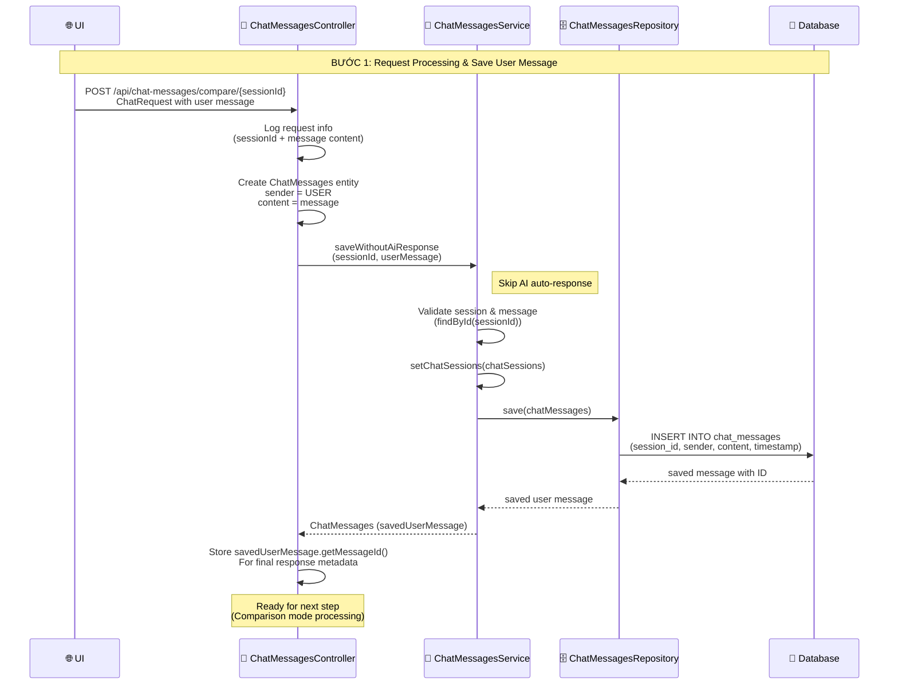

# 💬 BƯỚC 1: Request Processing & Save User Message - Sequence Diagram

## 📋 Tổng Quan

Tài liệu này mô tả quy trình lưu tin nhắn của người dùng vào database trước khi xử lý comparison mode.

## 📊 Sequence Diagram

### Cách xem diagram:
1. **Mermaid (GitHub/GitLab tự động render)**: Diagram sẽ tự động render trong file `.md`
2. **Online Mermaid Editor**: https://mermaid.live
3. **VS Code**: Cài extension "Markdown Preview Mermaid Support"

---

## 🎨 Mermaid Sequence Diagram



---

## 📝 Chi Tiết Quy Trình

### 1. UI Gửi Request
- **Method**: `POST`
- **Endpoint**: `/api/chat-messages/compare/{sessionId}`
- **Request Body**:
  ```json
  {
    "message": "User's question or message"
  }
  ```
- **Path Variable**: `sessionId` - ID của chat session

### 2. ChatMessagesController Nhận Request

#### 2.1. Log Request Info
- Log: "Bắt đầu chế độ so sánh cho phiên: [sessionId]"
- Log: "Tin nhắn người dùng: [message]"

#### 2.2. Create ChatMessages Entity
- `new ChatMessages()`: Tạo instance mới
- `setSender(ChatMessages.SenderType.USER)`: Đặt sender là USER
- `setContent(chatRequest.message())`: Đặt nội dung từ request

### 3. ChatMessagesService Xử Lý

#### 3.1. Validate Session & Message
- `chatSessionsRepository.findById(sessionId)`: Tìm session trong database
- Kiểm tra session có tồn tại không
- `chatMessages.setChatSessions(chatSessions)`: Gán session vào message

#### 3.2. Save Message
- Gọi `chatMessagesRepository.save(chatMessages)`
- Repository thực hiện INSERT vào database

### 4. Database Lưu Trữ

#### 4.1. INSERT Statement
```sql
INSERT INTO chat_messages 
(session_id, sender, content, timestamp)
VALUES 
(?, 'USER', ?, CURRENT_TIMESTAMP)
```

#### 4.2. Return Saved Message
- Database generate `message_id` tự động (IDENTITY)
- Trả về `ChatMessages` object với `messageId` đã được set

### 5. Controller Lưu Metadata

#### 5.1. Store Message ID
- `savedUserMessage.getMessageId()`: Lưu message ID để sử dụng sau
- Log: "Đã lưu tin nhắn người dùng với ID: [messageId]"

#### 5.2. Prepare for Next Step
- Chuẩn bị metadata cho response cuối cùng
- Sẵn sàng cho bước tiếp theo (Comparison mode processing)

---

## 🔄 Data Flow

```
UI Request
    ↓
ChatMessagesController
    ├─→ Log request info
    ├─→ Create ChatMessages entity
    │   ├─ sender = USER
    │   └─ content = message
    └─→ Call Service
        ↓
ChatMessagesService
    ├─→ Validate session (findById)
    ├─→ Set chatSessions relationship
    └─→ Call Repository
        ↓
ChatMessagesRepository
    └─→ Call Database
        ↓
Database
    ├─→ INSERT message
    ├─→ Generate messageId
    └─→ Return saved message
        ↓
Return to Controller
    └─→ Store messageId for metadata
```

---

## 🗄️ Database Schema

### Table: chat_messages
```sql
CREATE TABLE chat_messages (
  message_id BIGINT GENERATED BY DEFAULT AS IDENTITY,
  session_id BIGINT NOT NULL,
  sender VARCHAR(10) NOT NULL CHECK (sender IN ('USER', 'AI')),
  content TEXT NOT NULL,
  timestamp TIMESTAMP DEFAULT CURRENT_TIMESTAMP,
  PRIMARY KEY (message_id),
  CONSTRAINT fk_message_session
    FOREIGN KEY (session_id)
    REFERENCES chat_sessions (session_id)
    ON DELETE CASCADE
);
```

### INSERT Statement
```sql
INSERT INTO chat_messages 
(session_id, sender, content, timestamp)
VALUES 
(:sessionId, 'USER', :content, CURRENT_TIMESTAMP)
```

---

## 📡 API Endpoint

### POST /api/chat-messages/compare/{sessionId}
**Mô tả**: Lưu tin nhắn của user và xử lý comparison mode

**Path Variables**:
- `sessionId` (Long): ID của chat session

**Request Body**:
```json
{
  "message": "User's question or message"
}
```

**Response**: 
- Response sẽ được trả về sau khi xử lý comparison mode hoàn tất
- Message ID được lưu trong metadata: `saved_user_message_id`

---

## 🔑 Key Points

### Skip AI Auto-Response
- Method `saveWithoutAiResponse()` được sử dụng để **KHÔNG** tự động tạo AI response
- AI response sẽ được tạo riêng trong comparison mode
- Tránh duplicate AI calls

### Session Validation
- Service validate session tồn tại trước khi lưu message
- Nếu session không tồn tại, sẽ throw exception

### Message ID Storage
- Message ID được lưu để:
  - Thêm vào response metadata
  - Link với AI responses sau này
  - Tracking và debugging

---

## 🎨 Draw.io Instructions

### Cách tạo sequence diagram trong Draw.io:

1. **Mở Draw.io**: https://app.diagrams.net/

2. **Tạo diagram mới**: File → New → Blank Diagram

3. **Chọn template**: 
   - More Shapes → UML → Sequence
   - Hoặc tìm "Sequence" trong template gallery

4. **Thêm participants (Lifelines)**:
   - Kéo thả "Lifeline" cho mỗi participant:
     - UI
     - ChatMessagesController
     - ChatMessagesService
     - ChatMessagesRepository
     - Database

5. **Thêm messages**:
   - Dùng "Message" arrow (solid line) cho synchronous calls
   - Dùng "Return Message" arrow (dashed line) cho return values
   - Label messages với mô tả chi tiết

6. **Thêm self-loops**:
   - Dùng "Self Message" để chỉ internal operations
   - Label: "Log request info", "Create ChatMessages entity", etc.

7. **Thêm notes**:
   - Dùng "Note" shape để thêm ghi chú
   - Note: "Skip AI auto-response"
   - Note: "Ready for next step"

8. **Thêm activation boxes**:
   - Dùng "Activation" box để chỉ execution time
   - Hiển thị khi component đang xử lý

9. **Styling**:
   - Messages: Màu đen (solid) hoặc xanh (dashed)
   - Notes: Màu vàng nhạt
   - Activation boxes: Màu xám nhạt

10. **Lưu file**: 
    - File → Save As → `save_user_message_sequence.drawio`
    - Hoặc export as PNG/PDF

---

## 📝 Notes

- **No AI Response**: Method này chỉ lưu user message, không tạo AI response
- **Session Validation**: Service validate session tồn tại trước khi lưu
- **Foreign Key**: Message được link với session qua `session_id`
- **Auto Timestamp**: Database tự động set `timestamp` khi INSERT
- **Message ID**: Được generate tự động bởi database (IDENTITY)
- **Next Step**: Sau khi lưu user message, sẽ tiếp tục với comparison mode processing

